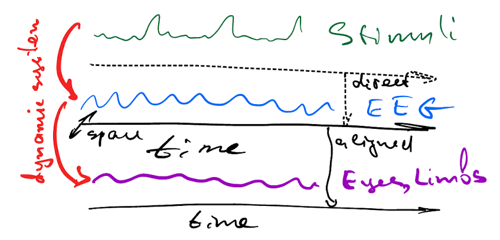

#  EEG and ECoG signal decoding review

The brain signals decoding models give a decent quality of limb movement classification in 2023. The base model is described in the [HTNet](https://github.com/BruntonUWBio/HTNet_generalized_decoding) by Brunton 2021, and it's precedent [EEGNet](https://github.com/vadim-vic/arl-eegmodels). The plan of the works for this overview is the following:
* search for the newest updates of HTNet and EEGNet
* develop these models towards the heterogenous multi-modal data like [Deliberate's](https://www.deliberate.ai/)
* move the problem statement from classification to decoding, assuming the phase space both in the source and the target spaces
* develop the [State-Space Models D4](https://github.com/MrRezaeiUofT/Deep_Direct_Discriminative_Decoder-D4-) by  Yousefi and Rezaei 2022 to 
*# use the Bayesian approach and, preferably, diffusion probabilistic models with normalizing flows
*# use Neural ODE networks with continuous layers to boost the approximation quality in the framework of SSM [Hippo](https://arxiv.org/abs/2206.12037) 2022
*# since the usage of Riemannian spaces and [PyRiemann](https://github.com/pyRiemann/pyRiemann) models by Barachant 2022 have great success in the EEG signal processing, consider works on the brain functional groups 

## Multi-modal heterogeneous data
The brain data comprises three main sources:
# the stimuli that the patient perceives, some video, and audio manifestations,
# the patient's brain signals, the EEG, and ECoG signals,
# the patient's body reaction, the eye and limb movement
These three sources are gathered in a common timeline and joined by the following causal relationship.

